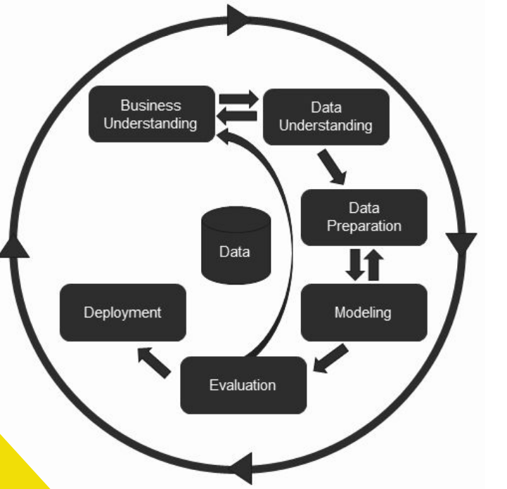
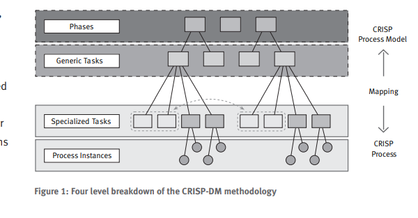
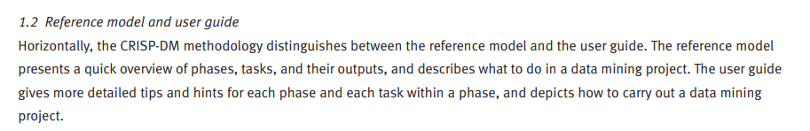
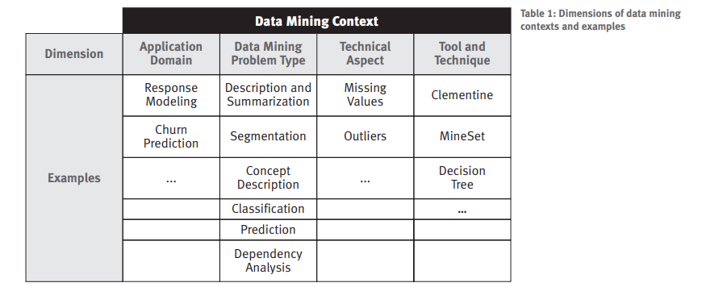
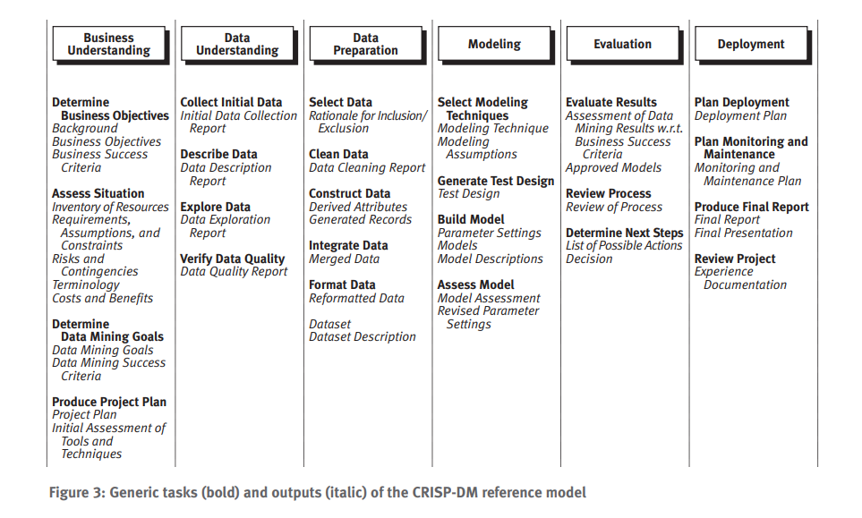

# CRISP-DM 1.0
 - Cross Industry Standard Process -  for Data Mining

## Etapas do processo
    - Business Understanding
    - Data Understanding
    - Data Preparation
    - Modeling
    - Evaluation
    - Deployment

## Modelo de hierarquia do processo 

## Organização do processo horizontal e vertical
__Reference Model na vertical__

__User Guide na horizontal__

## Exemplos de contexto de mineração de dados

## Descrição de Fases, **Tarefas Genéricas** e _outputs_

