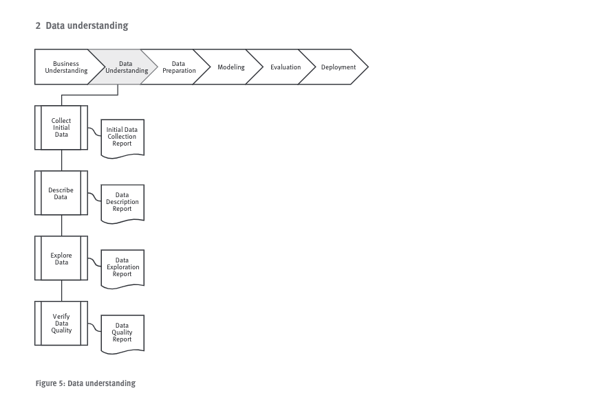

# Data Understanding

## Coletar dados iniciais
### Task
    Obter os dados listados no projeto e disponibilizá-los nas ferramentas de tratamento.

### Resultado
    Listar os conjuntos de dados, organizá-los em pastas, registrar informações de acesso e onde foram encontrados e quaisquer problemas que teve para acesso.

## Descrever os dados
### Task
    Examinar os dados brutos e registrar resultados.

### Resultado
    Descrever dados, formatos, quantidade e quaiquer informações relevantes a respeito dos conjuntos de dados.

## Explorar os dados
### Task
    Seleção, visualização e técnicas de relatórios são usados nessa etapa. Verificar relacionamentos entre dados, agregar valores e análises estatísticas simples, mas já voltadas aos objetivos de mineração de dados. Ajudam a alimentar melhores informações sobre os dados.

### Resultado
    Descrever reultados e hipóteses iniciais da análise e seus impactos no restante do projeto. Podemos incluir gŕaficos e plots que indicam as características dos dados para futuras análises.

## Verificar qualidade dos dados
### Task
    Nesse ponto é necessário se fazer alguns questionamentos a respeito dos dados:
        - Os dados estão completos?
        - Estão corretos, contém algum erro ou são muito comuns?
        - Há valores faltantes? Se sim, são representativos?

### Resultado
    Descrever os resultados da análise de qualidade dos dados, seus problemas, e possíveis soluções. Resolver problemas de qualidade de dados requer trabalhar muito bem nos dados e no entendimento de negócio.