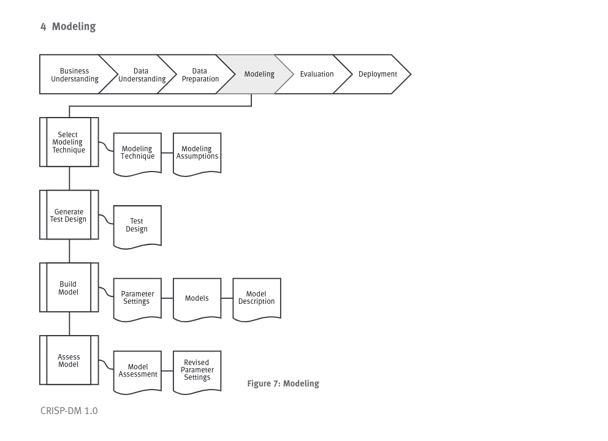

# Modeling

## Selecionar técnica de modelagem
### Task: Selecionar técnica de modelagem
    Selecionar a técnica de modelagem que será utilizada, por exemplo: Decision Tree, Neural Network. Se aplicar multiplas técnicas, separa essa tarefa para cada técnica.
### Resultado: 
    Descrever a técnica que será utilizada.
    Hipóteses da modelagem: Distribuição uniforme, não permite valores faltantes, atributos de classe tem que ser simbólicos. Descrever qualquer hipótese nesse ponto.

## Gerar design de teste
### Task: Gerar o Design de testes
    Antes de construir um modelo, precisamos gerar um mecanismo pra testar a qualidade e validade do modelo. Taxa de erro pode ser uma medida de qualidade. Normalmente aqui se separa o conjunto entre treino e testes. Construa o modelo no treino e avalie a qualidade com o teste.
### Resultado
    Descrever as intenções de treino, teste, e avaliação de modelos.
    Como e quais as intenções da divisões dos subconjuntos de treino e teste.

## Construir o modelo
### Task: Construir o modelo
    Executar a ferramenta de modelagem para criar um ou mais modelos.

## Resultados
    Toda ferramenta de modelagem possui diversos parâmetros que podem ser ajustados. Listar parametros e valores com a explicação do porque dessas configurações.

    Ao final desse processo, temos o modelo definido, não o relatório final/parecer.

    Descrever os resultados e interpretações do modelo. E documente qualquer dificuldade encontrada.

## Avaliação(Assess) do modelo
### Task: Construir o modelo
    Interpretar o modelo de acordo com o conhecimento de negócio, critérios de sucesso de mineração de dados e resultado do design de teste.
    
    Avaliar somente a modelagem, não o projeto inteiro nessa fase!!

    Ordene o do melhor para o pior dos modelos testados. Descreva os critérios de avaliação e de sucesso e os objetivos.

### Resultado
    Descreva os resultados dessa fase, liste o ranking dos modelos utilizados e a qualidade de um em relação ao outro.

    De acordo com o modelo de avaliação, revise os parâmetros, e prepare para mais uma execução. Faça isso até chegar ao que se acredita ser o melhor modelo. Documente todas as avaliações e revisões.    
