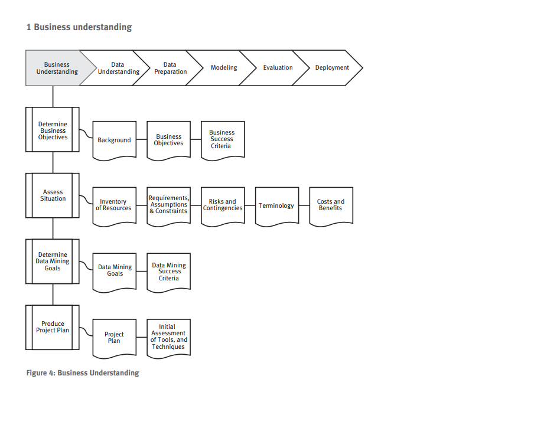

# Business Understanding

## Objetivos
   ### Task: Determinar o objetivo do negócio
   Entender sob a perspectiva de negócio, o que o cliente realmente quer obter. Fazer um balanço entre objetivos e restrições. Nessa fase é importante descobrir fatores que podem influenciar no resultado final do projeto. O fato de negligenciar esse passo, pode levar a respostas corretas para as questões erradas.
   ### Resultados: 
   #### Background
    Registrar as informações sobre a atual situação dos negócios da empresa no início do projeto.
   #### Objetivos de Negócios
    Descrever o principal objetivo do cliente, numa perspectiva de negócios.
   #### Critério de Sucesso do Negócio
    Descrever o critério de sucesso ou levantamento de informações úteis para o projeto pelo ponto de vista de negócios.

## Situação de avaliação
   ### Task
   Levantar maiores informações a respeito de recursos, restrições(constraints), premissas/suposições(assumptions) que devem ser levados em conta na análise dos dados e planejamento. Aqui expandimos os detalhes do entendimento de negócios.
   ### Resultados:
   #### Levantamento de recursos
    Pessoal, dados, hardware e software
   #### Requisições, premissas e restrições
    Agenda, qualidade de resultados, segurança, parte legal. Verificar acessos.
    Listar aquilo que se supõe e o que não se supõe sobre os dados. O que não se supõe é importante para validar dados.
    Listar as restrições, sejam elas de disponibilidade de recursosou tecnológicas, como tamanho de dataset.
   #### Riscos e contingências
    Listar os riscos ou eventos que podem causar atraso ou falha no projeto. Prepare um plano de contingência.
   #### Terminologia
    Construir um glossário com terminologias a serem utilizadas no projeto
   #### Custos e Benefícios
   Construir uma análise de custo-beneficio para o projeto. Comparando a situação atual com os potenciais beneficios que podem resultar no final do projeto.

## Objetivos da Mineração de dados
   ### Task
   #### Determinar objetivos da mineração de dados
    Determinar os objetivos em termos técnicos. Ex: Quantos itens um cliente irá comprar, analisando o histórico dos últimos 2 anos e as variações salariais, inflação, etc...

   ### Resultados:
   #### Determinar os critérios de sucesso
    Determinar em termos técnicos os critérios de sucesso. 

## Preparar um plano de projeto
   ### Taks
   #### Produzir um plano de projeto
    Descrever as intenções e objetivos. O plano deve especificar todos os passos durante o resto do projeto, incluindo ferramentas e técnicas que serão utilizadas.
   ### Resultados:
   #### Ter um planejamento de projeto claro
    Lista de estágios de execução de tarefas, duração, recursos necessários, dependências. Planejamento detalhado de cada fase. Nesse ponto deve ser decidida a estratégia da fase de avaliação. Essa parte do projeto pode e deve ser alterada sempre que necessário.
   #### Avaliar ferramentas e técnicas.
    É necessário avaliar técnicamente se as ferramentas irão suportar trabalhar com os dados envolvidos nesse ponto!!!!

