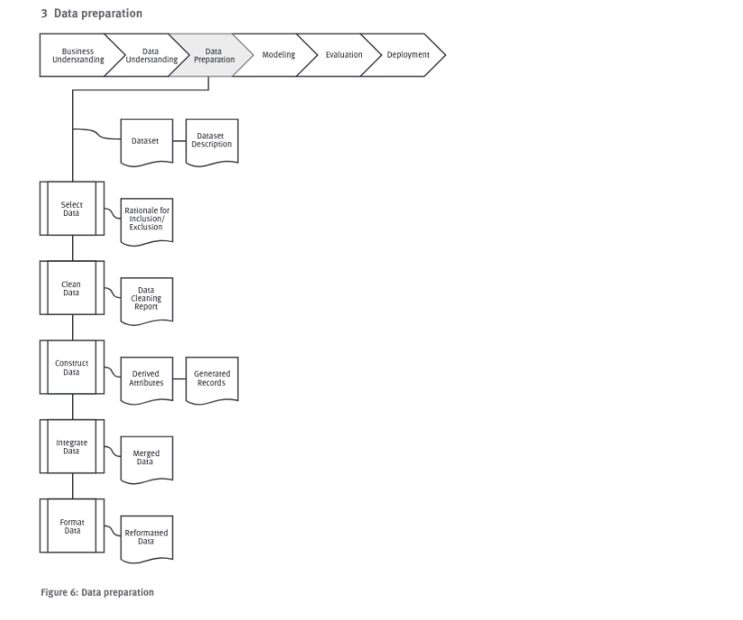

# Data Preparation

Nessa fase estão os conjutos de dados produzidos pela fase de preparação que serão utilizados na modelagem. Descrever cada conjunto de dados.

## Selecionar os dados
### Task
    Decidir quais dados serão utilizados de acordo com os critérios de relevância para os objetivos do projeto, qualidade e limitações técnicas.
    Seleção de colunas e linhas que serão utilizadas.

### Resultados
    Descriver os dados que serão utilizados e os que serão descartados e as razões para essas decisões.

## Limpar os dados
### Task
    Levantar a qualidade de dados necessária para dar andamento ao projeto através de análises técnicas. Isso pode envolver selecionar sub-conjuntos de dados, inserir valores default de acordo com técnicas de modelagem.

### Resultados
    Descrever que acções foram tomadas na limpeza e preparação dos dados. Transformações de dados nesse ponto podem ter impacto no resultado final do projeto, então é necessário cuidado.

## Construir os dados
### Task
    Operações de contruções de dados similares aos de produção de atruibutos derivados ou valores transformados de atributos existentes.

### Resultados
    Dados que simulam reultados finais derivados de dados básicos existentes em demais atributos.
    Descrever a criação desses dados e os motivos pelos quais foram necessários sua criação e manipulação.

## Integrar os dados
### Task
    Aqui são combinados dados de multiplas tabelas para criar novos registros ou valores.

### Resultados
    Registrar todas as tabelas e colunas que passaram por processo de merge.

## Formatar os dados
### Task
    Transformar, formatar dados preparando para modelagem. Aqui é ideal formatar chaves primarias de dados e tudo aquilo que for necessario para as ferramentas de modelagem.

### Resultado
    Algumas ferramentas tem necessidade que os dados tenham uma certa ordem de atributos, chaves únicas ou uma soma como ultimo atributo.
    Descrever o que foi feito com cada conjunto de dados nessa fase.    
