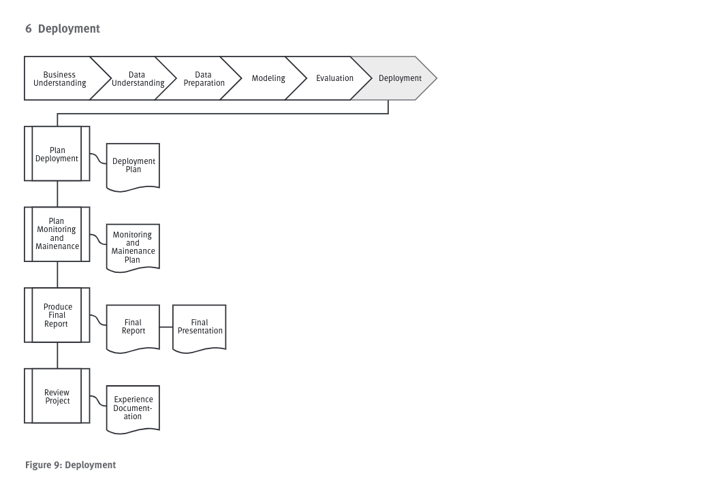

# Deployment

## Planejar Deploy
### Task: Planejar o deploy
    Documentar e montar a estratégia de deploy. Se esse processo gerar o procedimento padrão para futuras implementações, documentar os passos para futuras implementações.

### Resultados
    Resumir as estratégias de deploy incluindo o passo a passo e como executá-los.

## Planejar monitoramento e manutenção
### Task: Planejar monitoramento e manutenção
    Questões de monitoramento e manutenção são importantes e fazem parte do dia-a-dia de negócios e ambiente. Uma correta estratégia de manutenção ajuda a evitar longos períodos de uso errado e minimiza impactos. É ideal montar um plano de monitoramento da implantação.

### Resultados
    Um resumo com os passos para manutenção e monitoramento, e como executá-los.

## Produzir parecer(report) final
### Task: Produzir relatório final
    No final do projeto o time excreve um relatório final, coeso e compreensível que apresente os reultados finais do projeto.

### Resultados
    Preparar uma reunião final de conclusão do projeto, onde os resultados são apresentados ao cliente e disponibilizamos todos os entregáveis.

## Revisar o projeto
### Task: Avaliar projeto
    Avalie os acertos e erros, o que foi bem feito e o que ocorreu errado.

## Resultado
    Resumir experiências ganhas no projeto, dicas das melhores técnicas aprendidas e que podem ser utilizadas em situações semelhantes. É importante também incluir também parecer dos participantes do projeto.            